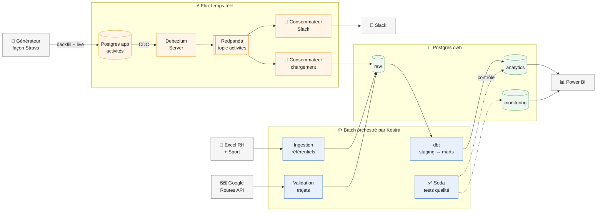

## Architecture du POC

```mermaid
flowchart LR
    GEN["🐍 Générateur<br/>façon Strava"]
    XLS["📄 Excel RH<br/>+ Sport"]
    GM["🗺️ Google<br/>Routes API"]

    subgraph RT["⚡ Flux temps réel"]
        APP[("Postgres app<br/>activités")]
        DBZ["Debezium<br/>Server"]
        RP[["Redpanda<br/>topic activites"]]
        CS["🐍 Consommateur<br/>Slack"]
        CL["🐍 Consommateur<br/>chargement"]
    end

    subgraph KES["⚙️ Batch orchestré par Kestra"]
        ING["Ingestion<br/>référentiels"]
        VAL["Validation<br/>trajets"]
        DBT["dbt<br/>staging → marts"]
        SODA["✅ Soda<br/>tests qualité"]
    end

    subgraph DWH["🐘 Postgres dwh"]
        RAW[("raw")]
        ANA[("analytics")]
        MONT[("monitoring")]
    end

    SLACK["💬 Slack"]
    PBI["📊 Power BI"]

    GEN -->|backfill + live| APP
    APP -->|CDC| DBZ --> RP
    RP --> CS --> SLACK
    RP --> CL --> RAW

    XLS --> ING --> RAW
    GM --> VAL --> RAW
    RAW --> DBT --> ANA
    SODA -.->|contrôle| ANA
    SODA -.-> MONT

    ANA --> PBI
    MONT --> PBI

    classDef rt fill:#FFF4E5,stroke:#E8A33D,color:#222
    classDef batch fill:#E8F1FB,stroke:#4A7FC1,color:#222
    classDef store fill:#EEF7EE,stroke:#4E9A5B,color:#222
    classDef ext fill:#F5F5F5,stroke:#888,color:#222
    class APP,DBZ,RP,CS,CL rt
    class ING,VAL,DBT,SODA batch
    class RAW,ANA,MONT store
    class GEN,XLS,GM,SLACK,PBI ext
```
