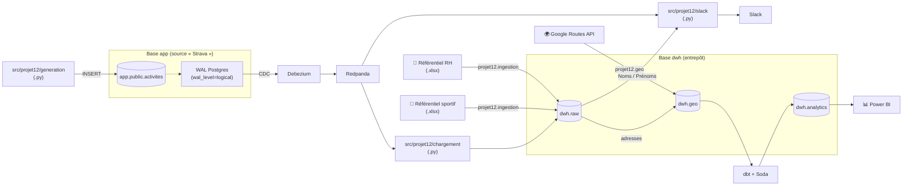

```mermaid
flowchart LR
    GEN["src/projet12/generation<br/>(.py)"]

    subgraph APP["Base app (source « Strava »)"]
        ACT[("app.public.activites")]
        WAL["WAL Postgres<br/>(wal_level=logical)"]
    end

    DBZ["Debezium"]
    RP["Redpanda"]
    SLKPY["src/projet12/slack<br/>(.py)"]
    SLACK["Slack"]
    CHG["src/projet12/chargement<br/>(.py)"]

    subgraph DWH["Base dwh (entrepôt)"]
        RAW[("dwh.raw")]
        GEO[("dwh.geo")]
        ANA[("dwh.analytics")]
    end

    XRH["📗 Référentiel RH<br/>(.xlsx)"]
    XSP["📗 Référentiel sportif<br/>(.xlsx)"]
    GOOG["🌍 Google Routes API"]
    DBT["dbt + Soda"]
    PBI["📊 Power BI"]

    GEN -->|INSERT| ACT
    ACT -.-> WAL
    WAL -->|CDC| DBZ
    DBZ --> RP
    RP --> SLKPY --> SLACK
    RP --> CHG --> RAW
    RAW -->|"Noms / Prénoms"| SLKPY
    XRH -->|projet12.ingestion| RAW
    XSP -->|projet12.ingestion| RAW
    RAW -->|adresses| GEO
    GOOG -->|projet12.geo| GEO
    GEO --> DBT --> ANA --> PBI
```
